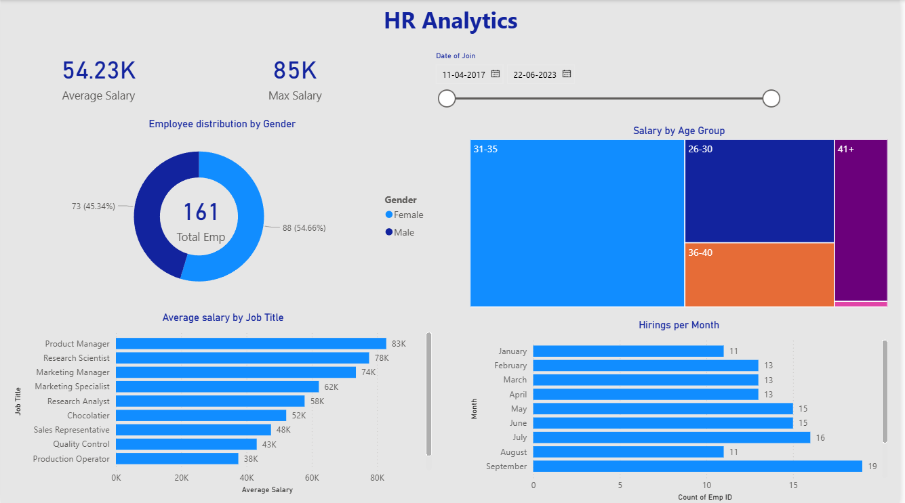

# 📊 HR Analytics Dashboard | Power BI Project

## 📌 Project Objective
Developed an interactive HR Analytics Dashboard in Power BI to analyze employee workforce data and monitor key HR metrics such as employee distribution, salary analysis, hiring trends, and demographic insights.

The dashboard helps HR teams and management make data-driven decisions by transforming raw Excel data into meaningful business insights.

---

## 🛠 Tools & Technologies Used
- Power BI
- Power Query
- DAX
- Excel

---

## 📂 Dataset Information

### Data Source
- Excel File
 
---

## 🔄 Project Workflow

## Step 1️⃣ Data Loading & Transformation (Power Query)

Imported Excel data into Power BI and performed data cleaning using Power Query.

## Data Cleaning Activities:
- Corrected column data types
- Removed unnecessary rows
- Standardized dataset structure
- Prepared clean data for reporting

---

## Step 2️⃣ Data Modeling
- No data modeling required because the project contains a single table dataset.

---

## Step 3️⃣ Dashboard Development

Created an interactive dashboard using KPI cards, slicers, DAX measures, and charts.

---

## 🧠 DAX Measures & Calculated Columns

## Measures

Average Salary = AVERAGE(Employee[Salary])

Max Salary = MAX(Employee[Salary])

Total Employees = COUNT(Employee[EmpID])
---

## Calculated Column

 Age Group =
SWITCH(
    TRUE(),
    Employee[Age] >= 21 && Employee[Age] <= 25, "21-25",
    Employee[Age] >= 26 && Employee[Age] <= 30, "26-30",
    Employee[Age] >= 31 && Employee[Age] <= 35, "31-35",
    Employee[Age] >= 36 && Employee[Age] <= 40, "36-40",
    "41+"
)
---

## 📊 Dashboard Features

## KPI Cards
- Average Salary
- Maximum Salary
- Total Employees

## Slicer
- Date of Joining

## Charts Used

## Donut Chart
- Employee Distribution by Gender

## Treemap
- Salary by Age Group

## Clustered Bar Chart
- Average Salary by Job Title

## Clustered Bar Chart
- Hiring by Month

---

## ❓ Business Questions Solved

1. What is the gender distribution of employees in the organization?

2. What is the total number of employees?

3. What is the average salary of employees?

4. What is the highest salary in the organization?

5. What is the employee age distribution?

6. What is the average salary distribution by job title?

7. Which month has the highest hiring activity?

---

## 📈 Key Business Insights
- Average employee salary is 54.23K while the maximum salary reached 85K
- Female employees are slightly higher than male employees.
- Age group 31–35 contributes the highest salary share.
- Product Managers receive the highest average salary.
- September recorded the highest hiring activity.
- Salary distribution varies significantly across different job titles.

---

## 💡 Business Recommendations

- Improve workforce planning using hiring trend analysis.
- Review salary structures for lower-paying job roles.
- Use employee demographic analysis for diversity planning.
- Track hiring patterns monthly for recruitment optimization.
- Use salary analysis to support compensation strategy decisions.

---

## 📷 Dashboard Preview

---

## 📁 Project Files

HR-Analytics-Dashboard/
│
├── HR-Analytics-Dashboard.pbix
├── HR-Data.xlsx
├── dashboard.png
└── README.md
---

## 🚀 Skills Demonstrated
- Power BI Dashboard Development
- Power Query Data Transformation
- DAX Measures
- Calculated Columns
- KPI Reporting
- Data Visualization
- HR Data Analysis
- Business Insight Generation

---

## 👨‍💻 Author

## Reshma Mishra
Aspiring Data Analyst 

